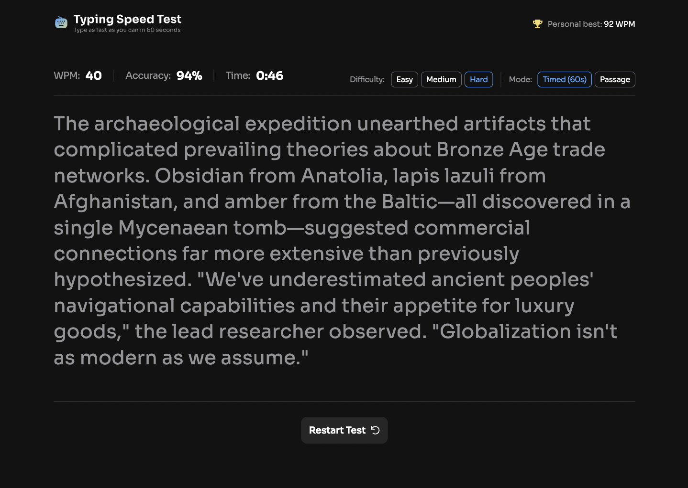
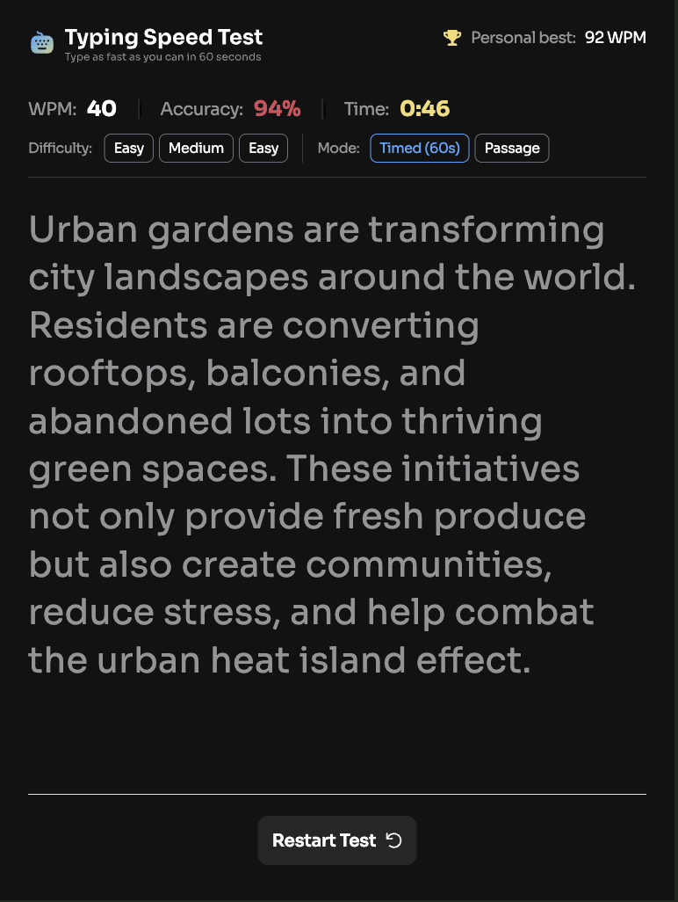

# 🚀 Typing Speed Test — Frontend Mentor Solution

This is my solution to the [Typing Speed Test challenge on Frontend Mentor](https://www.frontendmentor.io/challenges/typing-speed-test).  
Frontend Mentor challenges help developers improve real-world frontend skills by building projects from professional designs.

This project is being developed **individually**, with a strong focus on **pixel-perfect UI**, **responsiveness**, and **clean layout architecture** across **desktop, tablet, and mobile**.

---

## Table of Contents

- [Overview](#overview)
  - [The Challenge](#the-challenge)
  - [Screenshots](#screenshots)
  - [Links](#links)
- [My Process](#my-process)
  - [Day-by-Day Progress](#day-by-day-progress)
  - [Built With](#built-with)
  - [What I Learned](#what-i-learned)
  - [Challenges Faced](#challenges-faced)
  - [Continued Development](#continued-development)
- [Author](#author)
- [Acknowledgments](#acknowledgments)

---

## Overview

### The Challenge

Users should be able to:

- View the optimal layout for the interface depending on their device’s screen size
- Experience smooth transitions between different test states
- Interact with a clean and distraction-free typing interface
- See clear visual feedback for typing statistics
- Enjoy a seamless experience across desktop, tablet, and mobile without layout breaks

---

### Screenshots

1. 

2. 

3. 

📸 More screenshots will be added once the full responsive implementation and logic are complete.

---

### Links

- **Solution URL:** [Typing_Speed_Repo](https://github.com/yashiigupta/typing-speed-test)
- **Live Site URL:** [Keyboard_Masher](https://keyboard-masher.onrender.com)

---

## My Process

This project is being built incrementally, with a strong emphasis on:

- Understanding the design deeply before writing code
- Maintaining **pixel accuracy** instead of visual approximations
- Writing **scalable, breakpoint-aware UI architecture**
- Avoiding quick fixes in favor of clean layout logic
- Ensuring the experience feels native on **laptop, tablet, and mobile**

---

### Day-by-Day Progress

#### **Day 1 — Project Setup & Foundations**

Focused on setting a solid technical and structural base.

**What I worked on:**
- Set up the React application
- Added all required SVGs, icons, and assets
- Configured Tailwind CSS
- Organized a clean and scalable folder structure
- Started writing base styles using Tailwind
- Began implementing the desktop “not started” page
- Created initial reusable components (header, stats, layout wrappers)
- Explored strategies for responsive design without duplicating logic

**Key takeaway:**  
A strong foundation makes complex UI work significantly easier later.

---

#### **Day 2 — Pixel-Perfect Desktop & Figma Mastery**

Dedicated entirely to accuracy and design fidelity.

**What I worked on:**
- Built a pixel-perfect desktop (laptop) layout matching the Figma design
- Implemented:
  - Desktop “not started” page
  - Desktop “started” page
- Paid close attention to typography, spacing, alignment, and hierarchy
- Translated Figma design tokens into Tailwind utilities precisely
- Improved confidence in reading Figma specs instead of relying on visual guesswork

**Big learning:**  
Understanding *why* spacing exists in the design is just as important as matching it visually.

---

#### **Day 3 — Tablet Responsiveness (26 Dec)**

Shifted focus to adapting the layout for tablet devices.

**What I worked on:**
- Implemented tablet-specific layout adjustments
- Ensured the desktop structure scaled naturally to tablet screens
- Tweaked spacing, font sizes, and alignment for better tablet ergonomics
- Avoided unnecessary component duplication by reusing shared layout logic
- Verified that the “started” typing experience remained visually balanced

**Key focus:**  
Making the tablet view feel intentional — not like a scaled-down desktop.

---

#### **Day 4 & 5 — Mobile Responsiveness & UI Refinement (27–28 Dec)**

Focused on delivering a clean, usable mobile experience.

**What I worked on:**
- Built and refined the mobile layout for both:
  - “Not started” page
  - “Started” typing page
- Added **mobile-specific components** for:
  - Difficulty selection
  - Mode selection  
  (designed separately to improve usability on small screens)
- Ensured no vertical overflow or unwanted scrolling
- Carefully adjusted spacing, stacking order, and touch-friendly layouts
- Maintained visual consistency while adapting the UI to mobile constraints
- Verified seamless transitions between mobile, tablet, and laptop views

**Key achievement:**  
A responsive architecture that feels native on each device size instead of forced.

---

> This section will continue to be updated as development progresses.

---

### Built With

- React
- Tailwind CSS
- Figma (design reference)

---

### What I Learned

- How to build full-screen, no-scroll layouts correctly
- Why margins can introduce overflow issues in fixed-height designs
- How to rely on Flexbox, `flex-1`, and `gap` instead of stacking margins
- How Tailwind’s mobile-first breakpoints work in real-world layouts
- When to create mobile-specific components for better UX
- How to scale a single design system across multiple screen sizes cleanly

---

### Challenges Faced

- Preventing vertical overflow while keeping visual balance
- Handling responsiveness without over-duplicating components
- Translating Figma spacing rules into Tailwind utilities accurately
- Debugging layout issues caused by `h-screen` combined with margins
- Maintaining pixel perfection across laptop, tablet, and mobile
- Designing mobile UI that feels intentional rather than compressed

---

### Continued Development

Planned next steps:
- Complete and polish all responsive states
- Implement typing logic and state management
- Add accessibility improvements and keyboard handling
- Introduce subtle animations and transitions
- Optimize performance and UX
- Finalize screenshots and deploy the live site

---

## 👩‍💻 Author

- **Name:** Yashi Gupta  
- **Frontend Mentor:** _To be added_  
- **Portfolio:** _To be added_

---

## 🙏 Acknowledgments

- Frontend Mentor for providing well-designed real-world challenges
- The developer community for resources and discussions around layout, Tailwind, and responsiveness
